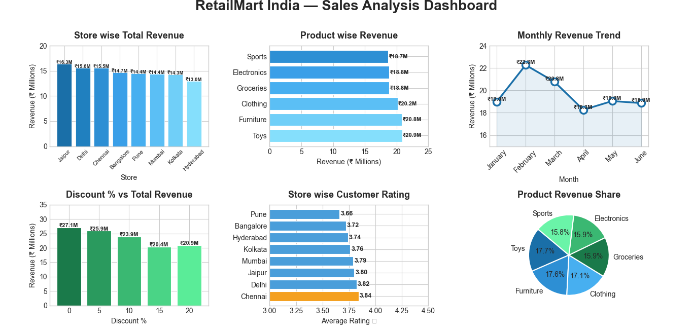

# RetailMart India — Sales Analysis 🛒📊

## Project Overview
Retail sales data analysis of 2000+ transactions 
across 8 cities in India using Python & Pandas.

## Key Insights
- 🏆 Top Store: Jaipur (₹16.3M revenue)
- 🛍️ Best Product: Toys (₹20.9M revenue)
- 📅 Best Month: February
- 💰 0% Discount = Maximum Revenue
- ⭐ Best Rated: Chennai (3.84)

## Tools Used
- Python
- Pandas
- NumPy
- Matplotlib

## Dashboard

